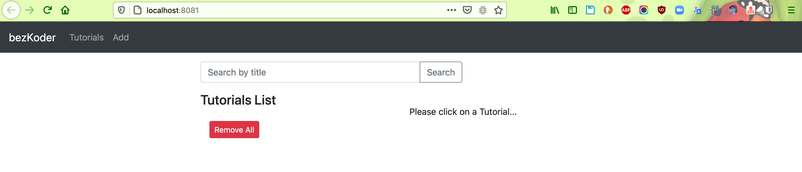
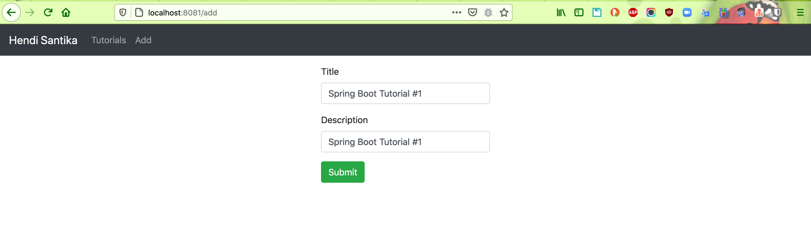
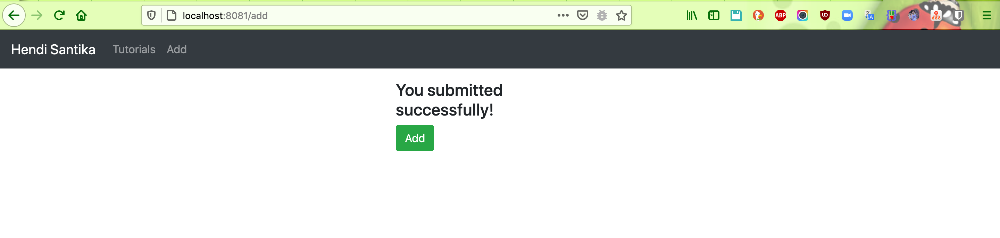
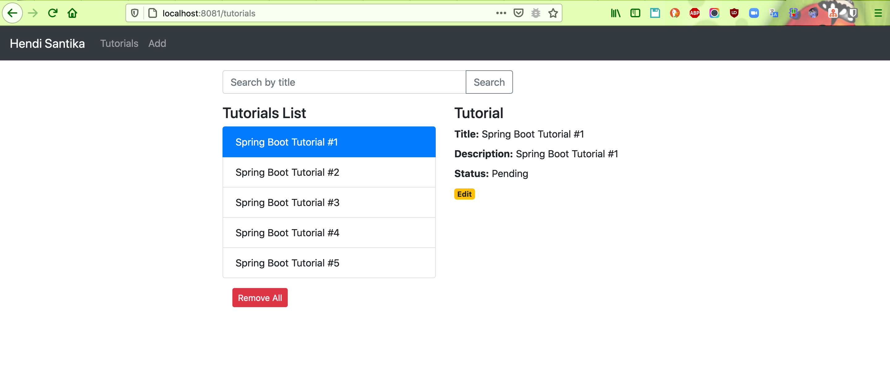
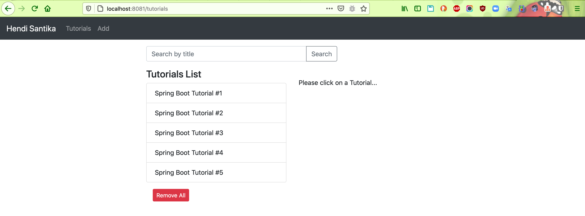
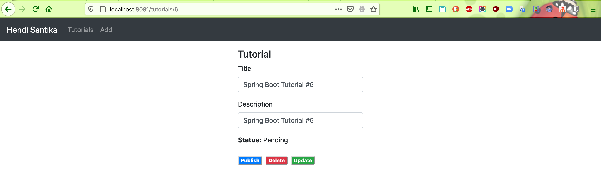
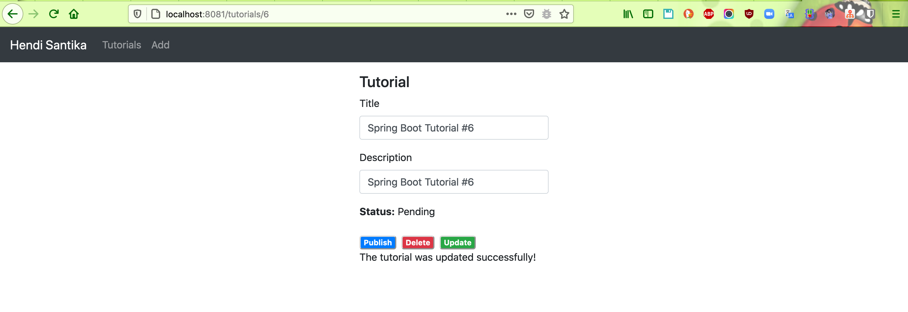

# springboot-vuejs-crud
Spring Boot Rest CRUD API example - Spring Data JPA to interact with MySQL/PostgreSQL database.

### Things todo list:
1. Clone this repository: `git clone https://github.com/hendisantika/springboot-vuejs-crud.git`
2. Go inside backend folder: `cd backend`
3. Run Spring Boot App: `mvn clean spring-boot:run`
4. Go inside frontend folder: `cd frontend`
5. Run VueJS: `npm install && npm run serve`
6. Open your favorite browser: http:/localhost:8081

### Image Screen shot
Home Page

Add New Tutorial

List All Tutorials

Edit Tutorial

